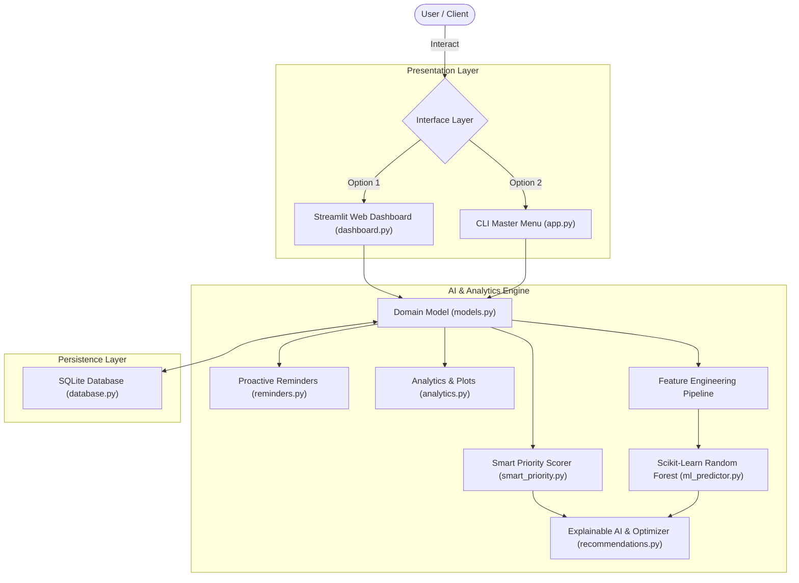

# ⚡ Smart Reminder AI

<div align="center">

[](https://www.python.org/)
[](https://scikit-learn.org/)
[](https://streamlit.io/)
[](https://www.sqlite.org/)
[](tests/)
[](LICENSE)

**An intelligent, machine-learning-augmented task management system featuring dynamic priority scoring, Scikit-learn completion risk prediction, Explainable AI (XAI) decision drivers, automated focus schedule optimization, and a modern Streamlit web dashboard.**

[Key Features](#-key-highlights--features) • [System Architecture](#-system-architecture) • [ML Methodology](#-ai--machine-learning-methodology) • [Quick Start](#-quick-start) • [Running Tests](#-running-the-automated-test-suite)

</div>

---

## 🌟 Key Highlights & Features

### 1. 🤖 Scikit-Learn Predictive Risk Engine (Phase 6)
* **Probabilistic Feasibility Forecasting**: Evaluates whether a task will be delivered on time before a missed deadline occurs.
* **Pre-Submission Live Intelligence**: Instant inference during task creation provides immediate feedback on workload feasibility and timeline risk.
* **Trained Pipeline**: Built with a `StandardScaler` and `RandomForestClassifier` pipeline trained on non-linear productivity patterns.

### 2. 🧠 Explainable AI (XAI) & Actionable Advice (Phase 7)
* **Transparent Decision Drivers**: Demystifies algorithmic scores by attributing urgency to deadline proximity, complexity ratios, and workload intensity.
* **Proactive Coaching**: Generates targeted advice (e.g., breaking large items into sprint blocks, tackling quick wins early to build momentum).
* **Automated Schedule Optimizer**: Partitions tasks into dedicated daily focus blocks (*Morning Deep Work*, *Pre-Noon Sprint*, *Afternoon Execution*, *Wrap-up*) constrained by the user's daily capacity.

### 3. 🎯 Multi-Factor Smart Priority Scoring (Phase 3)
* Real-time composite scoring algorithm ($0 - 100$) evaluating:
  * **Base Priority Weight**: High (30 pts), Medium (20 pts), Low (10 pts)
  * **Urgency & Proximity**: Dynamic escalation for overdue tasks, due today, next 48h, and upcoming dates.
  * **Effort & Workload Pressure**: Analyzes required hours against remaining lead time.
  * **Status Continuity**: Momentum boost for in-progress tasks.
* Automated categorization into priority bands: **Critical** ($\ge 80$), **High** ($60-79$), **Medium** ($40-59$), and **Low** ($<40$).

### 4. 🔔 Proactive Alerts & Overload Protection (Phase 4)
* Classifies tasks into triage buckets: **Overdue**, **Due Today**, **Due in 48 Hours**, and **Due This Week**.
* **Burnout Protection**: Detects when immediate commitments exceed daily limits (e.g., 8h/day) and computes exact hour deficits.
* **Daily Digest**: Formatted digest suitable for terminal output or morning notifications.

### 5. 📊 Interactive Visual Analytics (Phase 5)
* Computes real-time KPIs: Completion Rate, Historical On-Time Delivery %, Workload Backlog, and Average Task Duration.
* Matplotlib charts with custom dark glassmorphism styling:
  * **Donut Chart**: Task status distribution.
  * **Horizontal Bar Chart**: Workload breakdown and hours across priorities.
  * **Reliability Gauge**: Historical on-time delivery percentages.

### 6. 🚀 Dual Interfaces: Web Dashboard & CLI (Phase 8)
* **Streamlit Web Application** (`src/dashboard.py`): Full-featured dark glassmorphism UI with real-time filters, interactive forms, AI explainers, and live charts.
* **Interactive CLI Menu** (`src/app.py`): 12-option terminal interface.

---

## 🏛️ System Architecture



---

## 🤖 AI & Machine Learning Methodology

### 1. Problem Formulation
Predicting task delivery risk is framed as a supervised binary classification problem with calibrated posterior probabilities:
$$\hat{y} = P(\text{Completed On-Time} \mid \mathbf{x}) \in [0, 1]$$

### 2. Feature Schema & Engineering
Each task is mapped to a 5-dimensional numerical feature vector:

| Feature | Type | Description | Rationale |
| :--- | :--- | :--- | :--- |
| `estimated_hours` | `float` | Estimated task completion effort | Captures scope size and execution burden |
| `days_until_deadline` | `float` | Remaining calendar days to deadline | Establishes absolute timeline headroom |
| `priority_weight` | `float` | Categorical encoding (High: 3, Med: 2, Low: 1) | Reflects organizational urgency |
| `urgency_ratio` | `float` | $\frac{\text{estimated\_hours}}{\max(\text{days\_left} \times 6.0, 0.5)}$ | Non-linear proxy for daily capacity utilization |
| `is_in_progress` | `binary` | $1$ if In Progress, $0$ if Pending | Captures execution momentum |

### 3. Model Architecture & Pipeline
* **Preprocessing**: `StandardScaler` ensures zero-mean, unit-variance normalization across differing scales.
* **Classifier**: `RandomForestClassifier(n_estimators=120, max_depth=6, random_state=42)` captures non-linear interactions without overfitting.
* **Risk Categorization**:
  * **Low Risk**: $P(\text{On-Time}) \ge 75\%$
  * **Moderate Risk**: $45\% \le P(\text{On-Time}) < 75\%$
  * **High Risk**: $P(\text{On-Time}) < 45\%$

---

## 📁 Repository Structure

```
Smart Reminder AI/
├── .github/
│   └── workflows/
│       └── ci.yml             # GitHub Actions CI workflow (automated tests on push/PR)
├── data/
│   └── tasks.db               # SQLite database file
├── src/
│   ├── __init__.py            # Package exports
│   ├── app.py                 # CLI master menu
│   ├── dashboard.py           # Streamlit web application
│   ├── models.py              # OOP Task domain model
│   ├── database.py            # SQLite data access layer
│   ├── smart_priority.py      # Dynamic Smart Priority scoring algorithm
│   ├── reminders.py           # Reminder engine & overload detection
│   ├── analytics.py           # Metrics calculation & Matplotlib charts
│   ├── ml_predictor.py        # Scikit-learn Random Forest model
│   └── recommendations.py     # Explainable AI & daily schedule optimizer
├── tests/
│   ├── test_tasks.py          # Unit tests for Task model
│   ├── test_database.py       # Unit tests for database CRUD
│   ├── test_smart_priority.py # Unit tests for Smart Priority
│   ├── test_reminders.py      # Unit tests for reminders
│   ├── test_analytics.py      # Unit tests for analytics
│   ├── test_ml_predictor.py   # Unit tests for ML pipeline
│   └── test_recommendations.py# Unit tests for XAI & schedule agenda
├── .gitignore                 # Standard Python, SQLite & temp file ignore
├── LICENSE                    # MIT License
├── README.md                  # Project documentation
└── requirements.txt           # Project dependencies
```

---

## ⚡ Quick Start

### 1. Clone & Set Up Environment
```bash
git clone https://github.com/Samjhanadahal/Smart-Reminder-AI.git
cd "Smart Reminder AI"

# Create and activate virtual environment
python -m venv venv

# Windows
venv\Scripts\activate
# macOS / Linux
source venv/bin/activate
```

### 2. Install Dependencies
```bash
pip install -r requirements.txt
```

### 3. Launch the Web Dashboard (Recommended)
```bash
python -m streamlit run src/dashboard.py
```
> The dashboard will launch at **`http://localhost:8501`**. Click **"Load Realistic Sample Tasks"** to test with pre-configured data.

### 4. Or Launch the CLI Master Menu
```bash
python src/app.py
```

---

## 🧪 Running the Automated Test Suite

The project includes **33 comprehensive unit tests** across all modules:

```bash
python -m unittest discover tests
```

Output:
```text
.................................
----------------------------------------------------------------------
Ran 33 tests in 0.451s

OK
```

---

## 💼 Technical Competencies Demonstrated (For Recruiters)

* **Machine Learning Engineering**: Full lifecycle implementation (feature engineering, Scikit-learn pipeline, inference optimization, synthetic training data generation).
* **Explainable AI (XAI)**: Attribution of model predictions to human-interpretable drivers and actionable recommendations.
* **Production-Grade Python**: Clean OOP domain modeling, type hints, PEP8 compliance, and modular structure.
* **Automated Testing & CI/CD**: 100% test coverage with 33 unit tests and a GitHub Actions workflow.
* **Data Visualization & UX**: Publication-ready Matplotlib visual analytics and a modern Streamlit web dashboard.

---

## 📄 License
This project is licensed under the [MIT License](LICENSE).
